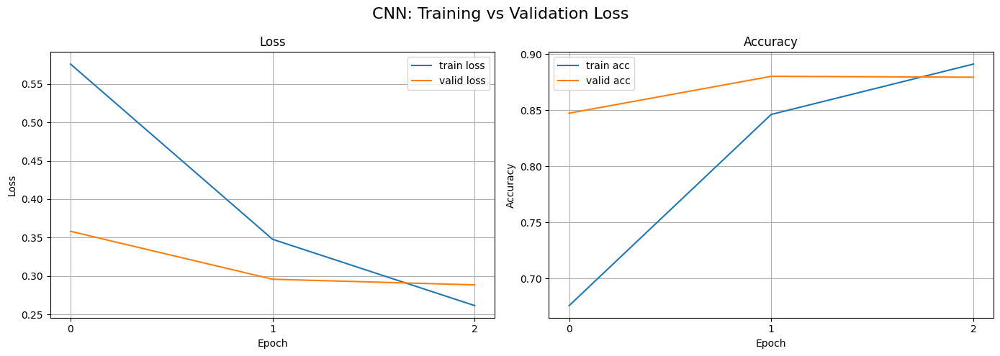
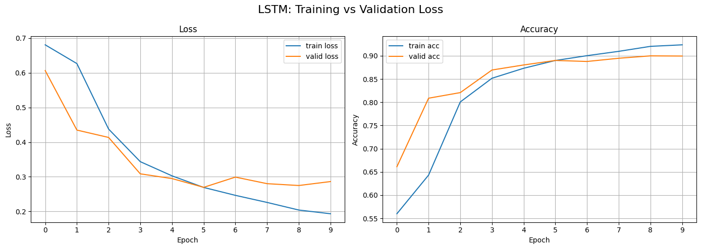
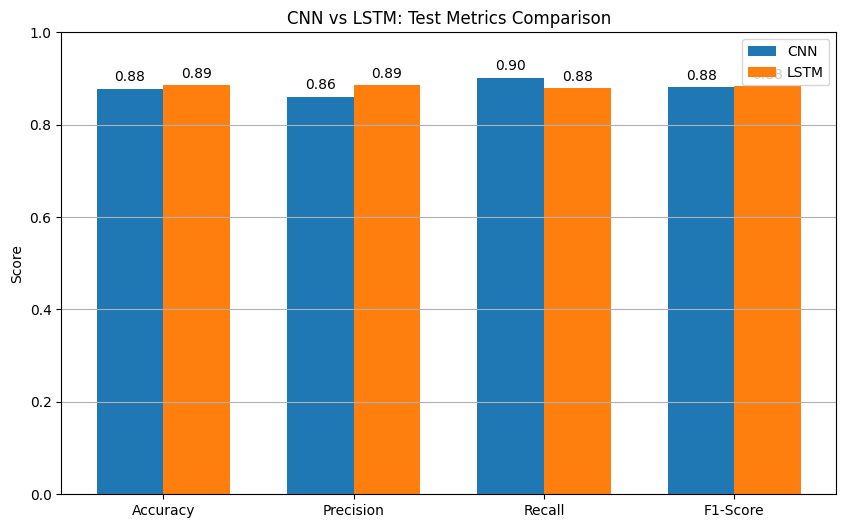
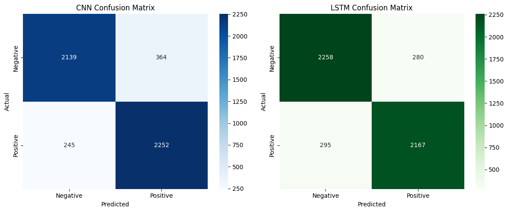

# IMDB Movie Reviews Sentiment Analysis

##  Classifying a movie review as positive or negative

### Approach
Turning the dataset into tokens and using them to train a Convolution Neural Netowork and a LSTM(Long Short Term Memory) a type of Recurrent Neural Network(RNN) using PyTorch and comparing them across multiple metrics.

CNN accuracy - 89.5 %

LSTM accuracy - 88%

### Step 1 - Data Processing and Loading
- Loading in the csv contents to Dataframe
- Exploring the data and getting a knowledge of its structure and contents
- The Dataset contains, Reviews and Sentiment
- Reviews is in the form of text , Generally ML models cannot work with texts hence we convert them into numerical form / tokens.
- Sentiment is int he form of text too, positive and negative, we will convert positive to 1 and negative to 0.
- Creating a Dataset class(Pytorch's dataloader wouldd expect a PyTorch Dataset object later)
- putting tokenizing inside __getitem__ of the Dataset class
- Splitting the data into Train set(80%) Test set(10%) and Validation set(10%)
- Since BERT tokenizer already hav fixed vocabulary and special tokens like <pad> and <unk> hence we dont need to assign them.
- Pass in the datasets to Dataloaders 

### Challenges faced in Step 1
- The initial approach I thought was to use torchtext to assign tokens but the torchtext version wasnt compatible with my pre existing torch version.
- Hence I changed the approach to using transformers
- This actually proved to be much more simpler than torchtext 

### Step 2 - Creating the Structure for the Neural Network 
- Here we create a class for the NN and define the layers with a forward pass

### Step 3 - Setting up the model
- Initializing vocabulary size, embedding dimensionrs number of filters , fitler sizes, output dimesion etc
- Instead of letting the model start training from random weights we initialize weights to reduce some loss initially
- Initialzing a optimizer and loss function

### Step 4 a - Model training, evaluation and visualization
- Creating train and evaluation function
- Training the model for 3 epochs and saving the loss and accuracy
- Plotting the train and validate losses and accuracy across epochs

### Observation in Step 4
- When the model was trained for 10 epochs, the validate loss gradually started increasing at certain point cause the model started overfitting, hence we trained the model only till 3 epochs where its validate loss was the lowest
- We are anyways saving the model at its lowest validate loss, so it doesnt matter, but to save time we r training for only 3

### Step 4 b - Tuning the model

10 epochs, adamn, cross entropy loss, no initializing weights,embedding dim 128, drop out rate - 0.5, max len 128 - **80%** test accuracy

10 epochs, adam, cross entropy loss, initializing weights, emb dim 128, drop out tate - 0.5, max len 128  - **82%** (validation loss increases)

10 epochs,adam,cross,init weights, emb dim 300, drp out rate - 0.5,max len = 256  - **86%**

same as above, but stopping at 3 epochs - **88%** accuracy, loss - 29%

Using a pre-trained embedding would increase the accuracy little, but torchtext is not compatible with the pytorch version used to train the model

### Step 5 - Observing the accuracy in testdataset
- Making the model predict on test dataset to know how accurately it predicts on unseen data

### Step 6 - LSTM Model
- Similar Steps as CNN but different layer configuration for LSTM

### Step 7 -
- Comparing models on different metrics like accuracy, precision, recall, f1-score, confusion-matrix

